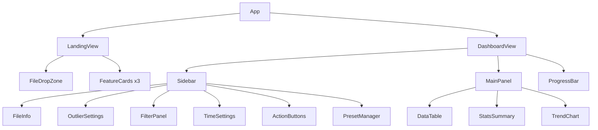

# σ 조기경보 데이터 전처리 — 웹 리디자인 플랜

> 상태 업데이트: 이 문서는 리디자인 방향을 설명하는 계획서입니다. 현재 저장소 기준 최신 웹 산출물은 `Preprocessing.html`이며, 원래 비교 대상으로 적은 `web_app.html`은 레거시 프로토타입입니다. 새 웹 개발은 `Preprocessing.html`을 기준으로 하되, Python 데스크톱 core와 결과 정합성이 완전히 검증된 상태라고 가정하지 않습니다.

## 현재 vs 목표

````carousel
### 🔴 현재 (web_app.html)
- 단일 컬럼, 모든 섹션 세로 나열
- 다크 모드 고정
- 파일 로드 전에도 모든 옵션 노출
- 10행 단순 프리뷰
- 순수 클라이언트 JS (서버 불필요)
<!-- slide -->
### 🟢 목표
- **2단계 UI**: 랜딩 → 대시보드 전환
- **2-column 레이아웃**: 좌측 컨트롤 / 우측 데이터
- 라이트 모드 기반 (보라/블루 액센트)
- 테이블 고도화 (검색, 페이지네이션, 정렬)
- 통계 요약 카드 + 데이터 시각화
- 순수 클라이언트 JS 유지 (Vercel 정적 배포)
````

---

## 화면 구성

### Phase 1: 랜딩 화면 (파일 업로드 전)

```
┌─────────────────────────────────────────────────┐
│  σ 조기경보 시계열 데이터 전처리 도구              │
│  데이터를 업로드하고 정제, 변환, 분석하세요         │
├─────────────────────────────────────────────────┤
│                                                 │
│              📄 시작하기                         │
│    CSV 파일을 업로드하여 전처리를 시작하세요        │
│                                                 │
│        ┌─────────────────────────┐              │
│        │  ☁️ 파일을 드래그하거나   │              │
│        │     클릭하여 업로드       │              │
│        │                         │              │
│        │    [ 파일 선택 ]         │              │
│        │    지원 형식: CSV        │              │
│        └─────────────────────────┘              │
│                                                 │
│    ┌──────────┐ ┌──────────┐ ┌──────────┐       │
│    │ 📊       │ │ 🔧       │ │ 🕐       │       │
│    │데이터     │ │이상값     │ │시간       │       │
│    │필터링     │ │처리      │ │보정       │       │
│    │조건별로   │ │σ/IQR    │ │간격 스냅   │       │
│    │필터      │ │기반 제거  │ │재정렬     │       │
│    └──────────┘ └──────────┘ └──────────┘       │
└─────────────────────────────────────────────────┘
```

> [!NOTE]
> - 중앙 정렬, 넉넉한 여백
> - 기능 소개 카드 3개 (필터링, 이상값 처리, 시간 보정)
> - 파일 드롭 시 즉시 Phase 2로 전환 (애니메이션)

---

### Phase 2: 대시보드 (파일 로드 후)

```
┌────────────────────────────────────────────────────────────┐
│  σ 전처리 도구    📄 sample_data.csv                v2.0  │
├──────────────┬─────────────────────────────────────────────┤
│              │                                             │
│  📄 파일 정보 │    데이터 테이블                             │
│  ─────────── │    총 52,000행 (52,000개 중)   🔍 검색...   │
│  파일명:      │   ┌───┬──────────┬──────┬──────┬─────┐    │
│  sample.csv  │   │ # │ DateTime │ Tag1 │ Tag2 │ ... │    │
│  행 수: 52000│   ├───┼──────────┼──────┼──────┼─────┤    │
│  열 수: 12   │   │ 1 │ 2026-... │ 45.2 │ 12.1 │     │    │
│              │   │ 2 │ 2026-... │ 45.8 │ 12.3 │     │    │
│  📊 이상값   │   │ 3 │ 2026-... │ 44.9 │ 11.9 │     │    │
│  ─────────── │   │...│          │      │      │     │    │
│  방법:       │   └───┴──────────┴──────┴──────┴─────┘    │
│  ○ 2σ       │    1-10 / 52,000    < 이전  1/5200 다음 >  │
│  ● 2.5σ     │                                             │
│  ○ 3σ       │   ──────────────────────────────────────── │
│  ○ IQR      │                                             │
│  ☑ 적용      │    📊 통계 요약                             │
│              │   ┌──────────┬──────────┬──────────┐       │
│  🔧 필터     │   │ 원본 행  │ 필터 제거 │ 이상값   │       │
│  ─────────── │   │ 52,000   │ -3,770   │ -892    │       │
│  열 선택 ▼   │   │          │          │          │       │
│  검색 값     │   └──────────┴──────────┴──────────┘       │
│  [ 필터 적용 ]│                                             │
│  + 필터 추가  │    📈 데이터 시각화 (선택 컬럼 트렌드)       │
│              │   ┌─────────────────────────────────┐      │
│  🕐 시간처리 │   │  ╱‾‾╲    ╱╲                     │      │
│  ─────────── │   │ ╱    ╲╱╱  ╲╱‾╲                  │      │
│  □ 시간 스냅 │   │╱              ╲___               │      │
│  □ 시간 재정렬│   └─────────────────────────────────┘      │
│  시작: [   ] │                                             │
│  간격: [2]분 │                                             │
│              │                                             │
│  ─────────── │                                             │
│  🚀 전처리   │                                             │
│   실행       │                                             │
│              │                                             │
│  💾 내보내기 │                                             │
│  CSV로 저장  │                                             │
│              │                                             │
│  📋 프리셋   │                                             │
│  저장 / 로드 │                                             │
│              │                                             │
│  🔄 초기화   │                                             │
│              │                                             │
├──────────────┴─────────────────────────────────────────────┤
│  ⏳ 진행:  ████████████████░░░░  80%  이상값 처리 중...    │
└────────────────────────────────────────────────────────────┘
```

---

## 컴포넌트 구조



---

## 디자인 시스템

### 색상

| 용도 | 색상 | 코드 |
|------|------|------|
| 배경 | 흰색 / 라이트 그레이 | `#FFFFFF` / `#F8F9FC` |
| 카드 | 흰색 | `#FFFFFF` |
| 테두리 | 연한 그레이 | `#E5E7EB` |
| 본문 텍스트 | 다크 | `#1F2937` |
| 보조 텍스트 | 미디움 그레이 | `#6B7280` |
| 주 액센트 | 보라/블루 | `#7C3AED` → `#6366F1` |
| 성공 | 그린 | `#10B981` |
| 경고 | 오렌지 | `#F59E0B` |
| 에러 | 레드 | `#EF4444` |

### 타이포그래피
- 제목: **Pretendard** 또는 **Inter** 700
- 본문: 400/500, 14px
- 테이블: 13px, 모노스페이스 숫자

### 여백 & 레이아웃
- 사이드바: 280px 고정폭
- 카드 패딩: 20px
- 섹션 간격: 16px
- 카드 라운딩: 12px
- 그림자: `0 1px 3px rgba(0,0,0,0.1)`

---

## 주요 UX 개선

### 1. 파일 로드 전/후 화면 전환
```
파일 없음 → LandingView (중앙 업로드)
파일 로드 → DashboardView (2-column, 애니메이션 전환)
```

### 2. 데이터 테이블 고도화
- **페이지네이션**: 10/25/50/100행 선택
- **검색**: 전체 텍스트 또는 컬럼별 검색
- **정렬**: 컬럼 헤더 클릭으로 오름/내림차순
- **고정 헤더**: 스크롤 시 헤더 고정
- **컬럼 하이라이트**: 이상값 포함 셀 빨간색 표시

### 3. 통계 요약 카드
파일 로드 및 처리 후 상단에 카드 3장:
- **원본 데이터**: 52,000행
- **필터 제거**: -3,770행 (빨간색)
- **최종 데이터**: 47,338행 (초록색)

### 4. 트렌드 차트 (선택사항)
- 컬럼 선택 시 간단한 라인 차트
- Canvas 또는 경량 라이브러리 (Chart.js ~60KB)
- 이상값 구간 빨간색 하이라이트

### 5. 사이드바 섹션 접기/펴기
- 각 섹션 헤더 클릭 시 토글
- 기본: 이상값, 필터 열림 / 시간처리 접힘

---

## 기술 스택

| 항목 | 선택 | 이유 |
|------|------|------|
| 프레임워크 | **순수 HTML/CSS/JS** 또는 **Next.js (v0.dev)** | Vercel 정적 배포 |
| 스타일 | Tailwind CSS + shadcn/ui | v0.dev 기본 |
| 차트 | Chart.js (CDN) | 경량, 서버 불필요 |
| CSV 파싱 | 자체 구현 (기존 코드) | 의존성 없음 |
| 상태 관리 | React useState/useReducer | 단순 구조 |
| 배포 | Vercel (정적) | GitHub 연동 |

---

## 구현 방향: 2가지 옵션

### 옵션 A: v0.dev로 생성 후 커스터마이즈
```
1. v0.dev에 참고 이미지 + 프롬프트 제출
2. 생성된 Next.js 코드를 GitHub export
3. 기존 web_app.html의 JS 로직을 이식
4. Vercel 배포
```
> **장점**: 빠른 초기 디자인, shadcn/ui 컴포넌트 활용
> **단점**: 생성 코드 품질 불확실, 커스터마이즈 필요

### 옵션 B: 직접 구현 (현재 web_app.html 리팩토링)
```
1. 기존 web_app.html을 2단계 UI로 리팩토링
2. CSS를 라이트 테마로 전환
3. 2-column 레이아웃 적용
4. 테이블/통계 컴포넌트 강화
5. Vercel 정적 배포
```
> **장점**: 기존 로직 100% 재활용, 의존성 없음
> **단점**: 디자인 작업 수동, 시간 더 소요

### 추천: 옵션 A → B 혼합
1. v0.dev로 **레이아웃과 디자인 틀**만 빠르게 생성
2. 생성된 디자인에서 **컴포넌트 구조와 CSS**만 가져옴
3. **전처리 로직**은 기존 `web_app.html`의 검증된 JS 그대로 이식

---

## 파일 구조 (Next.js 기준)

```
app/
├── page.tsx              # 메인 (Landing → Dashboard 전환)
├── layout.tsx            # 루트 레이아웃
├── globals.css           # 글로벌 스타일
├── components/
│   ├── landing/
│   │   ├── FileDropZone.tsx
│   │   └── FeatureCards.tsx
│   ├── dashboard/
│   │   ├── Sidebar.tsx
│   │   ├── DataTable.tsx
│   │   ├── StatsSummary.tsx
│   │   └── TrendChart.tsx
│   ├── controls/
│   │   ├── OutlierSettings.tsx
│   │   ├── FilterPanel.tsx
│   │   ├── TimeSettings.tsx
│   │   └── ActionButtons.tsx
│   └── ui/
│       ├── PresetModal.tsx
│       ├── ProgressBar.tsx
│       └── Toast.tsx
├── lib/
│   ├── preprocessor.ts   # 전처리 엔진 (기존 JS 이식)
│   ├── csv-parser.ts     # CSV 파싱
│   └── preset-manager.ts # 프리셋 (localStorage)
```
