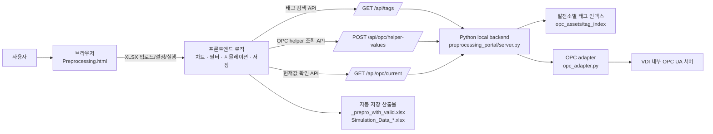
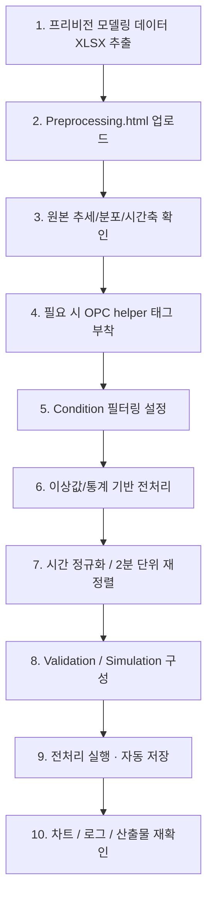
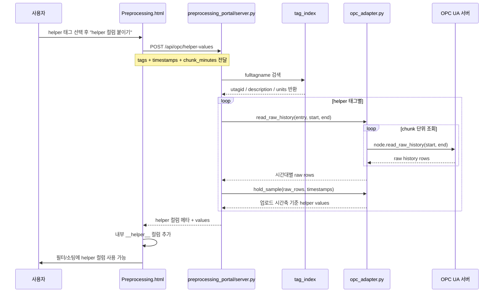
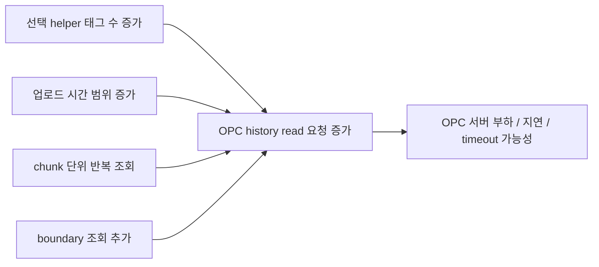
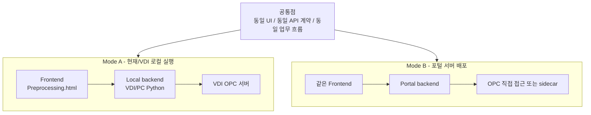
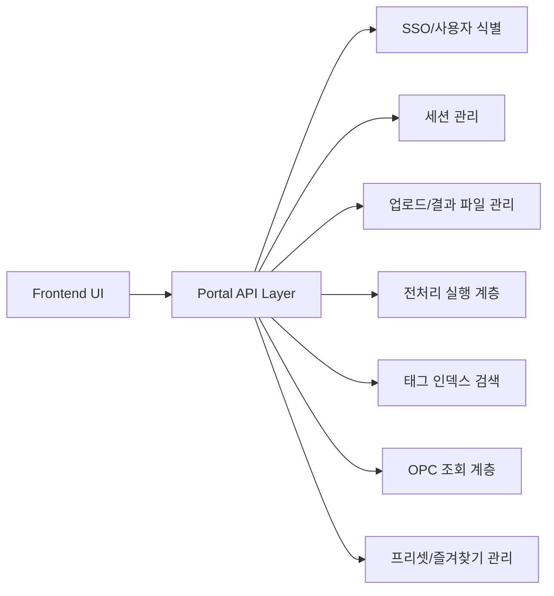

# Preprocessing 시스템 구조 / 배포 아키텍처 / API 흐름

이 문서는 팀원들이 현재 로컬 실행 구조와 향후 서버 배포 구조를 한 번에 이해할 수 있도록 정리한 시각화 자료입니다.

핵심 요약
- 현재 구조는 단순히 "브라우저만 로컬"인 것이 아니라, `브라우저 UI + Frontend JS 로직 + 로컬/VDI Python backend + 산출물 저장`까지 모두 로컬 자원을 사용하는 형태입니다.
- 즉, 차트/필터/시뮬레이션/전처리 흐름 제어와 결과 다운로드/저장은 Local PC 또는 VDI 세션 내부에서 실행됩니다.
- OPC 조회도 브라우저가 직접 하지 않고 로컬 Python backend API를 통해 수행합니다.
- 특히 OPC UA 연동은 방화벽 제약 때문에 서버에서 직접 붙지 못하고, 로컬/VDI 환경에서만 동작합니다.
- 서버 배포 시에는 같은 프론트엔드를 유지하고, backend를 포털 서버형으로 바꾸되, OPC helper 기능은 로컬 sidecar 또는 local backend를 통한 하이브리드 구조로 분리하는 방향이 가장 자연스럽습니다.
- 즉, `same frontend -> local backend` 와 `same frontend -> portal backend` 를 공통 API 계약으로 맞추되, OPC 연동만 별도 경로로 분리하는 것이 설계 핵심입니다.

---

## 1. 현재 로컬/VDI 실행 구조



설명
- `Preprocessing.html`은 사용자가 직접 보는 메인 UI입니다.
- 필터/이상값/시간 처리/Validation/Simulation 설정, 차트 검토, 결과 저장은 프론트에서 진행됩니다.
- OPC helper 태그는 브라우저가 직접 OPC에 붙지 않고 backend API를 통해 조회합니다.
- backend는 태그 인덱스를 참조해 `fulltagname -> utagid -> node id` 로 변환한 뒤 OPC UA 서버에서 현재값 또는 history를 읽습니다.

---

## 2. 현재 동작 방식: 업무 흐름 기준



이 흐름의 의미
- 단순 전처리 툴이 아니라, 프리비전 모델링 준비 과정의 병목을 순서대로 처리하는 Control Room입니다.
- 특히 `Condition 선별 -> 통계 기반 정제 -> 시간축 적합성 -> 검증용 산출물 준비` 를 한 흐름으로 묶는 것이 핵심입니다.

---

## 3. OPC helper 태그 조회 내부 흐름



중요 포인트
- helper 태그는 모델 입력값이 아니라 운전 구간 선별 기준입니다.
- 최종 저장 파일에는 helper 컬럼을 포함하지 않습니다.
- 조회 비용은 `선택 태그 수 x 조회 시간 범위 x chunk 수`에 비례합니다.

---

## 4. 왜 OPC 서버 부하 이슈가 생길 수 있는가



실무 해석
- helper 태그를 많이 고를수록 부하가 증가합니다.
- 업로드 파일 시간이 길수록 history 조회 범위가 커집니다.
- backend는 긴 구간을 chunk로 나누어 읽기 때문에, 호출 횟수도 늘어날 수 있습니다.
- 따라서 서버 배포 시에는 태그 수 제한, 기간 제한, 캐시, rate limit가 중요합니다.

---

## 5. 서버 배포 목표 구조

```mermaid
flowchart LR
    U[사용자 브라우저] --> FE[공용 Frontend
Preprocessing.html 기반]

    FE -->|HTTPS API| P[Portal Backend]
    P --> SESS[세션 저장소
sessions/{session_id}]
    P --> USER[사용자별 저장소
users/{user_id}]
    P --> IDX[발전소별 태그 인덱스]
    P --> PROC[전처리 엔진]
    P --> OPC[OPC 조회 계층
직접 접속 또는 내부 sidecar]

    PROC --> OUT[산출물 저장/다운로드
_prepro_with_valid.xlsx
Simulation_Data_*.xlsx]
```

설계 의도
- 프론트엔드는 그대로 유지합니다.
- backend만 로컬 Python backend에서 포털 서버 backend로 치환합니다.
- 사용자/세션별 업로드 파일, helper 메타, 결과 파일을 분리 저장합니다.
- 즐겨찾기/프리셋도 개인/공용을 나누어 관리합니다.

---

## 6. 권장 배포 모드 비교



권장 방향
- 가장 좋은 방향은 `same frontend, different backend` 전략입니다.
- 즉, 프론트는 하나로 유지하고 backend base URL만 바꾸는 구조가 유지보수에 유리합니다.

---

## 7. 권장 API 역할 분리

```mermaid
flowchart TD
    A[/GET /api/health/] --> A1[헬스체크]
    B[/GET /api/tags/] --> B1[발전소별 태그 검색]
    C[/GET /api/opc/current/] --> C1[선택 태그 현재값 조회]
    D[/POST /api/opc/helper-values/] --> D1[업로드 시간축 기준 helper history 조회]

    E[/POST /api/session/upload/] --> E1[파일 업로드 및 세션 생성]
    F[/POST /api/preprocess/run/] --> F1[전처리 실행]
    G[/GET /api/session/{id}/preview/] --> G1[차트/테이블 미리보기]
    H[/GET /api/session/{id}/download/] --> H1[산출물 다운로드]
    I[/GET/POST /api/presets/] --> I1[개인/공용 프리셋 관리]
    J[/GET/POST /api/favorites/] --> J1[OPC helper 즐겨찾기 관리]
```

해석
- 현재 skeleton에는 `health`, `tags`, `opc/current`, `opc/helper-values` 가 이미 있습니다.
- 서버형으로 가면 세션/업로드/실행/다운로드 API를 추가하는 방향이 자연스럽습니다.

---

## 8. 서버 배포 시 권장 책임 분리



실무 포인트
- UI는 사용자 경험과 시각화에 집중
- API는 요청 검증, 세션 분리, 권한 처리 담당
- 전처리 계층은 데이터 변환/산출물 생성 담당
- OPC 계층은 timeout, chunk, retry, rate limit, cache 담당

---

## 9. 팀원들이 자주 궁금해할 포인트 정리

### Q1. 왜 브라우저가 OPC 서버에 직접 붙지 않나?
- 브라우저 단독 정적 HTML만으로는 VDI/사내 OPC망 접근, 인증, history read 제어가 어렵습니다.
- 그래서 Python backend/sidecar가 OPC read를 맡는 구조가 안전합니다.

### Q2. 왜 frontend는 그대로 두고 backend만 바꾸려 하나?
- 현재 UI/튜토리얼/차트/설정 흐름이 이미 잘 잡혀 있기 때문입니다.
- 배포 모드가 바뀌어도 사용자 경험은 그대로 유지하는 게 좋습니다.

### Q3. 서버 배포 시 가장 중요한 리스크는?
- OPC 네트워크 접근 가능 여부
- 다중 사용자 세션 충돌
- helper history 조회 부하
- 업로드/결과 파일 정리 정책

### Q4. 서버 배포 시 API는 어떻게 가는 게 좋은가?
- 현재 OPC 관련 API는 유지
- 여기에 세션/업로드/실행/다운로드 API를 추가
- 개인/공용 프리셋과 helper 즐겨찾기 API를 분리

---

## 10. 최종 한 줄 설명

- 현재는 `브라우저 + 로컬 Python backend` 구조로 동작하고,
- 서버 배포 시에는 같은 프론트엔드를 유지한 채 `포털 backend + 세션/파일/OPC 계층`으로 확장하는 방향이 가장 자연스럽습니다.
- 핵심은 OPC 조회와 전처리 실행을 브라우저 밖의 API 계층으로 분리하고, 프리비전 모델링 준비 업무 흐름은 그대로 유지하는 것입니다.
